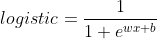

# Regression
在这，我通过numpy实现了线性回归和逻辑回归以此来更加深入地了解这两个简单的算法。算法所使用的数据由随机函数生成。
# Environment
python 3.7  
numpy 1.18  
sklearn  
# loss function
# Linear Regression
均方差：  
导数：
# Logistic Regression
交叉熵：  
导数：
# 线性方程
其中  
导数：  
  

# Result
线性回归  

逻辑回归  
  
逻辑回归的公式如下所示:  

在这里，若prob>0.5，则认为X属于lable1。prob>0.5=>wx+b>0。而x=[x1, x2]。所以，logistic的分类界面为y = -(w1/w2)*x + -(b/w2)。该分类界面为一条直线，因此logistic并不能分类非线性问题，除非z本身就是非线性的，或者我们可以通过堆叠多个Logistic来使得netword具备了非线性能力。为了能够更好地证明上述理论，我使用了logistic来分类异或问题。可视化结果如下所示:  

由于精度问题，有时候我们可能会得到50%的正确率。但是对于上述分类界面是不可能达到这样的精度。它的精度要么为25%或75%。精度问题我们可以将其转换为np数组来探讨。
