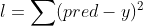
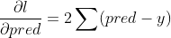
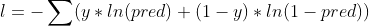
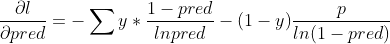
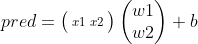
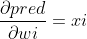
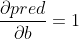
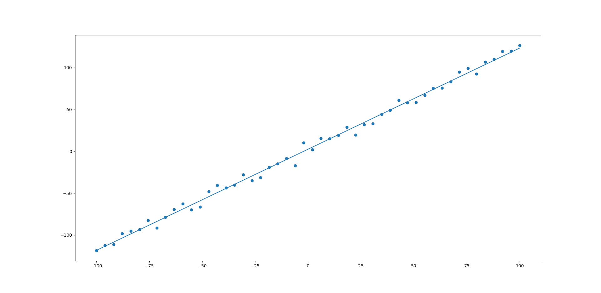
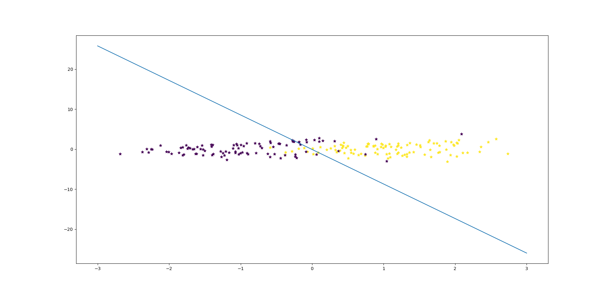

# Regression
在这，我通过numpy实现了线性回归和逻辑回归以此来更加深入地了解这两个简单的算法。算法所使用的数据由随机函数生成。
# Environment
python 3.7  
numpy 1.18  
sklearn  
# loss function
# Linear Regression
均方差：  
导数：
# Logistic Regression
交叉熵：  
导数：
# 线性方程
其中  
导数：  
  

# Result
线性回归  

逻辑回归  

